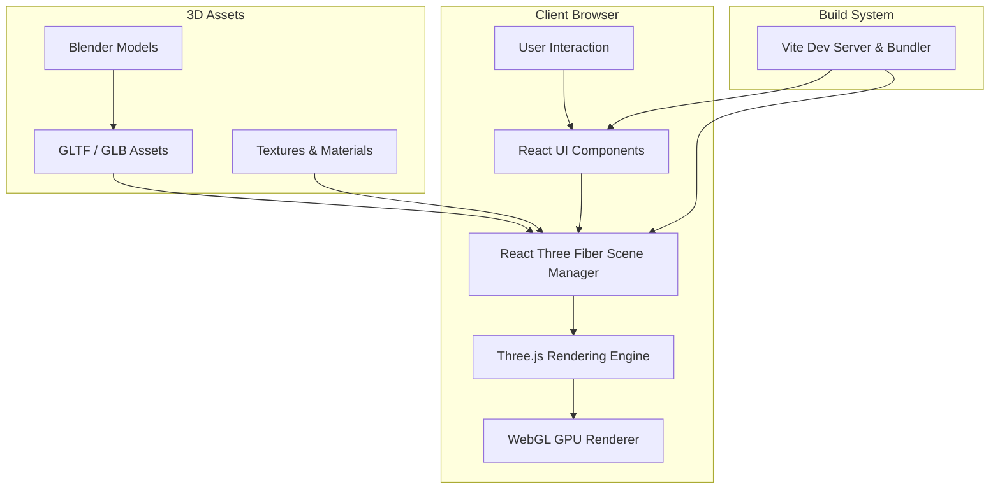

# 💌 Feb14Public3D — Interactive 3D Web Experience

  
  
  
  

  

An **interactive 3D web experience** built using **React, Three.js, and Blender**, designed to create an immersive animated environment directly in the browser.

The project explores how **3D graphics, animation, and modern frontend frameworks** can be combined to create engaging interactive storytelling experiences on the web.

---

## 🌐 Live Demo

🔗 https://feb3d.shreyanshraj.com

Experience the full interactive 3D scene directly in your browser. (Not optimized for small screens currently)

---

## ✨ Highlights

- Real-time **3D rendering in the browser** using WebGL
- Custom **3D models designed in Blender**
- Interactive animations and scene transitions
- Smooth camera movement and immersive environment
- Built using **React Three Fiber + Three.js**

---

## 🏗 Architecture

The project uses a **modern WebGL rendering architecture** where React manages UI and scene logic, while Three.js handles real-time 3D rendering.

### Architecture Explanation

**User Layer**

* Handles user interaction with the 3D environment
* Mouse / scroll / camera interactions

**Application Layer**

* React manages UI components
* React Three Fiber connects React to Three.js

**Rendering Layer**

* Three.js manages the scene graph
* WebGL performs GPU-accelerated rendering

**Asset Layer**

* 3D models created in Blender
* Exported as optimized GLTF/GLB files
* Loaded dynamically into the scene

---

## 🧠 Tech Stack

**Frontend**

* React
* React Three Fiber
* Three.js

**3D Design**

* Blender
* GLTF / GLB assets

**Tooling**

* Vite
* WebGL

---

## 🎨 Design Focus

This project focuses on creating a **visually engaging interactive environment** where users explore a stylized 3D world rather than navigating a traditional webpage.

Key design considerations:

• optimized 3D assets for web performance
• smooth animation transitions
• immersive scene composition
• responsive camera interactions

---

## 👨‍💻 Author

**Shreyansh Raj**

Software Engineer | AWS Cloud Developer
M.S. Computer Science — Arizona State University

GitHub
https://github.com/shreyanshraj
